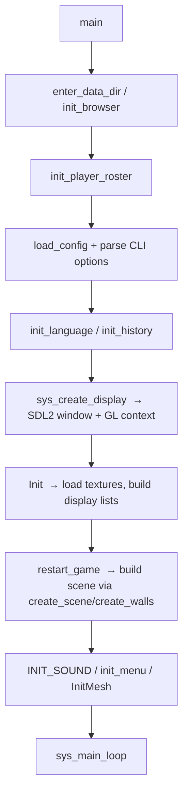

# FooBillard++ — Programmer's Overview

A refresher for developers getting (back) up to speed on the codebase. It maps
the architecture, explains how the pieces fit together, and points to the files
you'll actually touch. Pair this with the top-level [README](../README.md) (user
docs + build) and the [ChangeLog](../ChangeLog).

---

## 1. What this is

FooBillard++ is a single-binary, single-threaded OpenGL billiard game written in
**C**. It is a modernized fork of `foobillard 3.0a` (Florian Berger) via
`foobillard++` (Holger Schaekel), now **ported from SDL 1.2 to SDL2**.

- Language: C (C89/C99-ish, GNU dialect), no C++ except the macOS `SDLMain.m`.
- Rendering: **legacy fixed-function OpenGL** (`glBegin/glEnd`, display lists,
  matrix stack) + GLU. Not modern shader-based GL.
- Windowing/input/audio/net: **SDL2**, SDL2_mixer, SDL2_net.
- Assets: PNG textures (libpng), TrueType fonts (FreeType 2).
- Build: **GNU Autotools** (`configure.in` → `configure`, `Makefile.am`).

Everything runs in one process on one thread. The "game loop" is a plain
`while(1)` in `sys_main_loop()` that polls events, renders one frame, and swaps
buffers. There is no separate simulation thread — physics is stepped inside the
display function.

---

## 2. Repository layout

| Path | What lives there |
| ---- | ---------------- |
| [src/](../src) | All game source (`.c`/`.h`). This is where you work. |
| [data/](../data) | Runtime assets: textures, fonts, locales, music, HTML for history/tournament reports. |
| [osx/](../osx) | macOS Xcode project + `SDLMain`, platform `config.h`. |
| [debian/](../debian) | Debian packaging. |
| [contrib/](../contrib) | Standalone experiments/reference snippets (fastmath, net, utf8). **Not compiled into the game.** |
| [src-graphics/](../src-graphics) | GIMP/Blender source art (`.xcf`), not shipped. |
| `configure.in`, `Makefile.am`, `buildme.sh` | Build system. |

### The `src/` files, grouped by role

**Core / orchestration**
- [src/billard3d.c](../src/billard3d.c) — **The heart of the program (~8k lines).**
  Contains `main()`, the frame/display function `DisplayFunc()`, all input event
  handlers (`MouseEvent`, key handling), game-state machine, rules enforcement,
  camera, HUD, tournament flow, and the networking glue. Start here.
- [src/billard.c](../src/billard.c) — Table/scene *setup*: builds ball racks
  (8-ball, 9-ball, carambol, snooker) and wall/hole geometry via function
  pointers (`create_scene`, `create_walls`).

**Physics (the simulation)**
- [src/billmove.c](../src/billmove.c) — **Physics engine.** `proceed_dt()` advances
  the world one timestep: ball motion, ball-ball and ball-wall collisions,
  friction, spin, pocket detection. Records what was hit for rules/sound.
- [src/ball.c](../src/ball.c) — Ball *rendering* (GL display lists / vertex
  arrays), not physics. (Physics on balls is in `billmove.c`.)
- [src/vmath.c](../src/vmath.c) — Vector/matrix math library (`VMvect`,
  `VMmatrix4`, dot/cross, quaternion-ish base vectors). Used everywhere.

**AI**
- [src/aiplayer.c](../src/aiplayer.c) — AI decision layer: picks a target ball/shot.
- [src/evaluate_move.c](../src/evaluate_move.c) — Shot search/scoring the AI uses to
  evaluate candidate shots.

**UI / presentation**
- [src/menu.c](../src/menu.c) — In-game menu system (the `menuType`/`menuEntry`
  tree, `menu_choose()`, submenus, callbacks).
- [src/font.c](../src/font.c), [src/textobj.c](../src/textobj.c) — FreeType text
  rendering; `textObj`/`textObj3D` are cached text sprites/meshes.
- [src/helpscreen.c](../src/helpscreen.c) — On-screen help.
- [src/history.c](../src/history.c) — Game/tournament history persisted as XML +
  XSL for browser viewing (see [data/html/](../data/html)).

**Platform / I/O**
- [src/sys_stuff.c](../src/sys_stuff.c) — **SDL2 platform layer.** Window/GL context
  creation, fullscreen, resolution list, the main loop `sys_main_loop()`, and
  `process_events()` which translates SDL events into the game's handlers.
- [src/sound_stuff.c](../src/sound_stuff.c) — SDL2_mixer sound/music.
- [src/net_socket.c](../src/net_socket.c) — SDL2_net IPv4 networking primitives.
- [src/png_loader.c](../src/png_loader.c) — libpng texture loader.
- [src/options.c](../src/options.c) — All tunable `options_*` globals + defaults.
- [src/language.c](../src/language.c) — Locale/string table (`localeText[]`).
- [src/queue.c](../src/queue.c) — Cue ("queue") stick geometry/drawing.
- [src/getopt_long.c](../src/getopt_long.c) — Bundled `getopt_long` for CLI parsing.

**Static 3D scenery (generated mesh data)**
- `cartoonguy.c`, `sittingboy.c`, `chess.c`, `flower.c`, `bottle.c`,
  `fireplace_high.c`, `ceilinglamp_high.c`, `room.c`, `table.c`, `mesh.c`,
  `fire.c`, `bumpref.c`, and the big `*.h` data headers (`bartable.h`,
  `barchair.h`, `burlap_sofa.h`, …). These are mostly **exported vertex data**
  for room decoration. High line counts, low logic — you rarely edit these.

---

## 3. Key data structures

Defined mainly in [src/billmove.h](../src/billmove.h) and
[src/player.h](../src/player.h):

- `BallType` — one ball: mass/inertia/diameter, position `r`, velocity `v`,
  angular velocity `w`, orientation base `b[3]`, `nr` (0=white…), and flags
  `in_game` / `in_hole` / `in_fov`, plus a recorded `path` for replay/AI.
  ⚠️ Its byte layout is assumed by the networking code in `billard3d.c` — see the
  comment in the header before reordering fields.
- `BallsType` — the set of balls + `gametype` (`GAME_8BALL`, `GAME_9BALL`,
  `GAME_CARAMBOL`, `GAME_SNOOKER`).
- `AdvBorderType` / `BordersType` / `HoleType` — cushion segments (point/line/
  arc), friction/loss coefficients, and pocket geometry with an AI aim point.
- `struct Player` — per-player state: `is_AI`, `is_net`, score, cue-ball index,
  aim offsets `cue_x`/`cue_y`, `strength`, snooker state, name/text objects.
- `struct PlayerRoster` — up to `ROSTER_MAX_NUM` (16) players (needed for
  tournaments); the two live players are exposed as the global `player[]`.

Handy macros (in [src/billard3d.h](../src/billard3d.h)) alias the current player's
fields: `CUE_BALL_IND`, `queue_strength`, `queue_point_x/y`, etc.

---

## 4. Program lifecycle



`main()` lives at [src/billard3d.c](../src/billard3d.c) (~line 8084). It reads the
config file `~/.foobillardrc` first, then CLI args override it (see README's
config section). Function pointers `create_scene`/`create_walls` are set per game
type so the rest of the engine is game-agnostic.

### The main loop

`sys_main_loop()` in [src/sys_stuff.c](../src/sys_stuff.c) (~line 890):

```
while(1) {
    process_events();     // drain SDL event queue → game handlers
    DisplayFunc();        // step physics + render one frame
    SDL_GL_SwapWindow();  // present
    // (throttle to ~15ms/frame unless vsync is on)
}
```

`process_events()` (~line 801) maps SDL2 events to handlers. Note the SDL2-era
specifics: window resize is `SDL_WINDOWEVENT`/`SDL_WINDOWEVENT_RESIZED` (not
`SDL_VIDEORESIZE`), and the **mouse wheel is its own `SDL_MOUSEWHEEL` event** —
this fork added `handle_wheel_event()` so the wheel adjusts shot strength again.

### The frame function (`DisplayFunc`)

`DisplayFunc()` in [src/billard3d.c](../src/billard3d.c) (~line 4119) is where most
per-frame logic lives:

1. If networking, sync the peer.
2. Compute `dt` from `SDL_GetTicks()`; smooth camera distance/rotation.
3. **Fixed-timestep physics:** while accumulated time remains, call
   `proceed_dt(&balls, &walls, TIMESTEP, player)` with `TIMESTEP = 0.01s`. This
   decouples simulation rate from framerate.
4. Emit ball/wall hit sounds from what `proceed_dt` recorded.
5. Detect the **balls-stopped transition** (`!balls_moving && balls_were_moving`)
   → resolve overlaps, apply rules, switch turns, hand off to AI/network.
6. Set up camera + lights, then draw: room/table, balls, cue, HUD, menu, effects
   (shadows, reflections, lens flare, anaglyph stereo).

---

## 5. Control flow you'll care about

- **Turn/rules state machine** lives in `DisplayFunc` around the balls-stopped
  transition and the per-game-type rule helpers in `billard3d.c`. This is the
  trickiest area: fouls, ball-in-hand, 8/9-ball/snooker specifics, tournament
  advancement.
- **AI turn:** when the active player `is_AI`, the game asks `aiplayer.c` for a
  shot, which uses `evaluate_move.c` to score candidates, then feeds the chosen
  strength/aim back through the same `proceed_dt` path a human shot would use.
- **Menu:** `menu.c` builds a tree of `menuType`/`menuEntry`; selecting an entry
  fires a callback (many defined in `billard3d.c`, keyed by `MENU_ID_*`).
- **Input:** keyboard/mouse handlers in `billard3d.c` set aim, spin (button 2 +
  Shift), strength (wheel), camera (LMB rotate, RMB zoom / +CTRL FOV), and fire
  the shot.

---

## 6. Build & run

Autotools; see [buildme.sh](../buildme.sh) and README for full details.

```sh
./buildme.sh          # aclocal/autoconf/autoheader/automake, then ./configure && make
cd src && make        # fast incremental rebuild after editing sources
```

Binary is `src/foobillardplus`. Notable configure flags: `--enable-sound`,
`--enable-network`, `--enable-mathsingle` (single vs double precision — must match
across networked clients), `--enable-fastmath`, `--enable-sse`.

**Debug build** (symbols): `configure.in` clears `CFLAGS` by default, so:

```sh
CFLAGS="-g -O0" ./configure --enable-standard && cd src && make clean && make
```

`make clean` is required when only `CFLAGS` change — the Makefile doesn't track
them as a dependency.

---

## 7. Gotchas & landmines

- **SDL 1.2 → SDL2 migration is recent and not 100% audited.** When something
  input/window/timer-related misbehaves, suspect an SDL2 API difference. Known
  fixed examples: mouse wheel (`SDL_MOUSEWHEEL`), window resize event, and
  `SDL_TimerID` now being a pointer-ish type (compare against `0`, not `NULL`).
- **Fixed-function OpenGL only.** Don't reach for shaders/VBOs expecting them to
  exist; rendering is display lists + immediate mode.
- **Global state everywhere.** `player[]`, `balls`, `walls`, and the many
  `options_*` globals are shared mutable state. Physics, rendering, and rules all
  read/write them; be careful about ordering within a frame.
- **`BallType` layout is wire-format.** Reordering/resizing its fields breaks
  network play (see the warning comment in [src/billmove.h](../src/billmove.h)).
- **Precision toggle.** `VMfloat` is `float` or `double` depending on
  `--enable-mathsingle`; mixed-precision peers can't play together over the net.
- **Big `*.c`/`*.h` scenery files are generated data**, not hand-written logic —
  don't try to "refactor" them.
- **Init order in `main()` matters** (data dir → config → language → history →
  display → Init → restart_game). Several later steps assume config/language are
  already loaded.
- **README historically claimed SDL 1**; it now correctly documents **SDL2** —
  install `libsdl2-dev libsdl2-net-dev libsdl2-mixer-dev`, not the 1.2 packages.

---

## 8. Where to start for common tasks

| Goal | Start in |
| ---- | -------- |
| Change physics/collision behavior | [src/billmove.c](../src/billmove.c) (`proceed_dt`) |
| Tweak rules / turn logic / fouls | [src/billard3d.c](../src/billard3d.c) (balls-stopped transition in `DisplayFunc`) |
| Improve the AI | [src/aiplayer.c](../src/aiplayer.c) + [src/evaluate_move.c](../src/evaluate_move.c) |
| Add/edit menu items | [src/menu.c](../src/menu.c) + `MENU_ID_*` callbacks in `billard3d.c` |
| Window/input/timing/SDL issues | [src/sys_stuff.c](../src/sys_stuff.c) |
| New game/rack/table geometry | [src/billard.c](../src/billard.c) |
| Options / CLI flags / defaults | [src/options.c](../src/options.c), `long_options` in `billard3d.c` |
| Text / localization | [src/language.c](../src/language.c), [src/font.c](../src/font.c), [src/textobj.c](../src/textobj.c) |
| Sound / music | [src/sound_stuff.c](../src/sound_stuff.c) |
| Networking | [src/net_socket.c](../src/net_socket.c) + net glue in `billard3d.c` |
```

